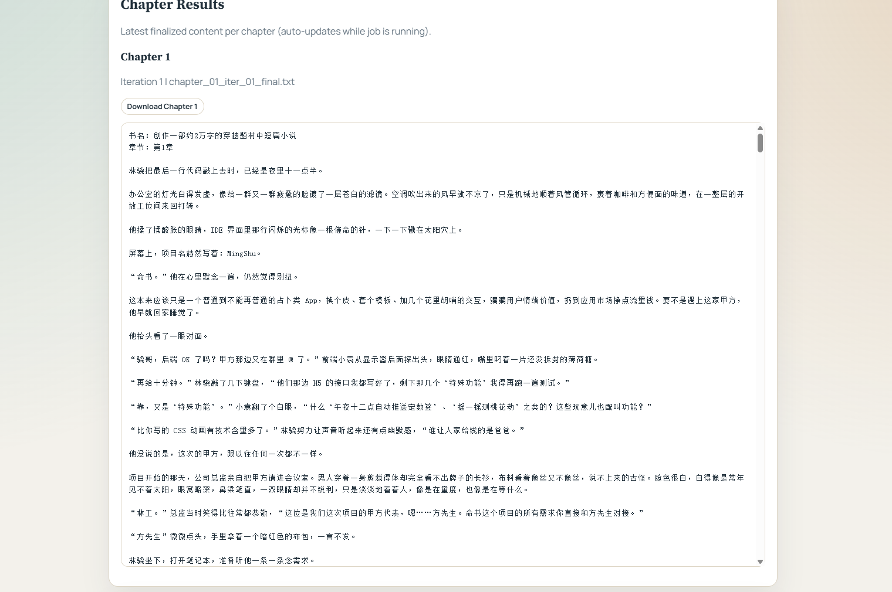

# CoLong Idea Studio

<div align="center">

**动态记忆优先的协同式长篇创意与小说生成智能体框架**

[在线体验 / Live Portal](https://colong-idea-studio.cloud) | [Project Page / 论文展示页](https://xiao-zi-chen.github.io/CoLong-Idea-Studio/) | [English Documentation / 英文文档](README.md)


**✦ 强调学术表达、协同交互与部署可用性**  
**✧ 面向长篇、分章、强一致性写作任务而设计 (*`-`*)**

**🧠 动态记忆优先**  |  **🤝 协同式创意完善**  |  **📝 可观测日志**  |  **📚 长篇创意生成**

</div>

## ✦ 摘要

`CoLong Idea Studio` 面向长篇、分章、强一致性的创意写作与小说生成任务，采用**动态记忆优先**范式。  
系统围绕“**规划 -> 写作 -> 检索 -> 存储 -> 回注**”构建闭环，使后续章节能够持续对齐前文已经形成的人物、设定、事实和叙事承诺。

相较于高度依赖静态知识库的流程，本框架更强调：

1. **🤝 协同式创意完善**：在正式写作前，由智能体持续追问并细化用户创意。
2. **🧠 动态记忆驱动生成**：在生成过程中持续回写并检索大纲、事实、人物设定、世界观设定和章节摘要。

## 🌐 在线入口

- 在线 Web 门户： [https://colong-idea-studio.cloud](https://colong-idea-studio.cloud)
- 科研展示页： [https://xiao-zi-chen.github.io/CoLong-Idea-Studio/](https://xiao-zi-chen.github.io/CoLong-Idea-Studio/)

## 🖼️ 示例展示

以下是两个界面示例：




## 🏛️ 论文展示页

若需要查看更偏科研展示风格的项目主页，包括系统概览、工作流图、评测快照与仓库入口，请访问：

- [CoLong Idea Studio Project Page](https://xiao-zi-chen.github.io/CoLong-Idea-Studio/)

## 🧩 系统架构


当前仓库使用提供的工作流图片作为系统架构图，用于展示从协同式创意完善到动态记忆驱动章节生成的整体路径。

## ✍️ 方法设计

### 🧠 1) 动态记忆上下文构建

写作提示上下文由以下三部分组成：

1. 固定注入：滚动摘要、最近章节摘要、最近事实卡片。
2. 语义检索：从动态记忆向量库中召回相关条目。
3. 类型聚合：按人物、大纲、世界观、情节与事实卡片进行组织后再注入提示词。

### 🤝 2) 协同式创意完善作为 Agent 过程

创意阶段被实现为**Agent 级协同循环**，而不是简单的前端问答辅助。`Idea Copilot Agent` 会持续追问，直到用户明确确认创意已经足够成熟，可以进入正式写作阶段。

典型协同路径如下：

1. 用户给出初始题材、设定、主题或剧情种子。
2. 智能体围绕冲突、设定、人物动机、叙事语气、结构和受众预期提出针对性问题。
3. 用户逐轮补充与修正创意。
4. 当用户明确确认后，系统将创意结果固化为更稳定的写作 brief，并进入大纲生成阶段。

✧ 这一设计可显著降低创意输入过于粗糙导致的后续漂移问题，也更符合协同式长文本生成系统的研究定位 (o^_^o)

---

## 📝 Progress Log 协议

路径：

```text
runs/<run_id>/progress.log
```

事件行格式：

```text
[event] YYYY-MM-DD HH:MM:SS | <event_name> | chapter <n> | <detail>
```

结构化章节行：

```text
chapter=<n>, words=<w>, planned_total=<p>, target=<t>, min=<l>, max=<u>, topic=<topic>
```

典型事件：

| 事件名 | 含义 |
|---|---|
| `global_outline` | 全局大纲落库 |
| `chapter_outline_ready` | 章节大纲集合就绪 |
| `chapter_plan` | 当前章节写作计划 |
| `chapter_outline` | 当前章节大纲摘要 |
| `chapter_length_plan` | 本章 target 与推断来源 |
| `chapter_length_warning` | 实际字数偏离期望区间 |
| `character_setting` | 人物设定写入 |
| `world_setting` | 世界观设定写入 |
| `memory_snapshot` | 动态记忆快照 |
| `outline_character/world/retrieval` | 大纲阶段产物日志 |

✦ Progress Log 被有意设计为更丰富、更透明的观测层，使用户不仅能看到生成结果，也能看到隐藏在生成后的大纲、计划、记忆和设定层信息 (=^.^=)

---

## 🧠 动态记忆模型

`memory_index.json` 维护以下桶：

- `texts`
- `outlines`
- `characters`
- `world_settings`
- `plot_points`
- `fact_cards`

说明：

1. `texts` 保存章节正文与阶段性文本产物。
2. `outlines` 保存全局大纲、章节计划、章节摘要与滚动摘要。
3. `fact_cards` 作为轻量事实约束，用于降低跨章节漂移。

在当前配置思路下，项目更适合运行于**动态记忆优先模式**，静态 RAG 与静态知识模块可以在必要时被弱化甚至关闭，以避免对长篇创意生成造成不必要干扰。

## 📁 项目结构

```text
.
├─ agents/                  # 写作、检索与协同创意 Agent
├─ workflow/                # analyzer / organizer / executor
├─ rag/                     # 动态记忆与检索逻辑
├─ utils/                   # LLM 客户端与工具模块
├─ local_web_portal/        # 多用户 FastAPI 门户
├─ docs/                    # 图片与文档资源
├─ config.py                # 配置中心
└─ main.py                  # CLI 入口
```

---

## 🚀 快速启动

### CLI

```bash
python -m venv .venv
# Windows
.venv\Scripts\activate
# Linux/macOS
# source .venv/bin/activate

python -m pip install --upgrade pip
python -m pip install -r requirements.txt
python main.py
```

### 🌐 Web 门户

```bash
python -m pip install -r requirements.txt
python -m pip install -r local_web_portal/requirements.txt
# Windows
copy local_web_portal\.env.example local_web_portal\.env
# Linux/macOS
# cp local_web_portal/.env.example local_web_portal/.env
python -m uvicorn local_web_portal.app.main:app --host 0.0.0.0 --port 8010
```

访问：

```text
http://127.0.0.1:8010
```

---

## 📦 部署原则

面向服务器部署时，建议仅上传运行必需文件，并尽可能排除以下内容：

1. 历史产物：`runs/*`
2. 历史向量库：`vector_db/*`, `vector_db_tmp/*`
3. 本地状态：`local_web_portal/data/*`
4. 缓存与环境：`.venv/*`, `__pycache__/*`, `*.pyc`

这种白名单式部署策略可以减少仓库噪声、降低冷启动复杂度，并减少本地运行产物意外泄露的风险。

## 🌐 文档入口

GitHub 默认落地页当前使用英文版，以提升公开展示时的可读性。  
如需查看完整中文说明，请访问：

- [README.zh-CN.md](README.zh-CN.md)

## 📚 引用

```bibtex
@software{colong_idea_studio_2026,
  title        = {CoLong Idea Studio: A Dynamic-Memory-First Collaborative Agent Framework for Long-Form Creative Ideation and Story Generation},
  author       = {xiao-zi-chen and contributors},
  year         = {2026},
  url          = {https://github.com/HITSZ-DS/CoLong-Idea-Studio}
}
```
