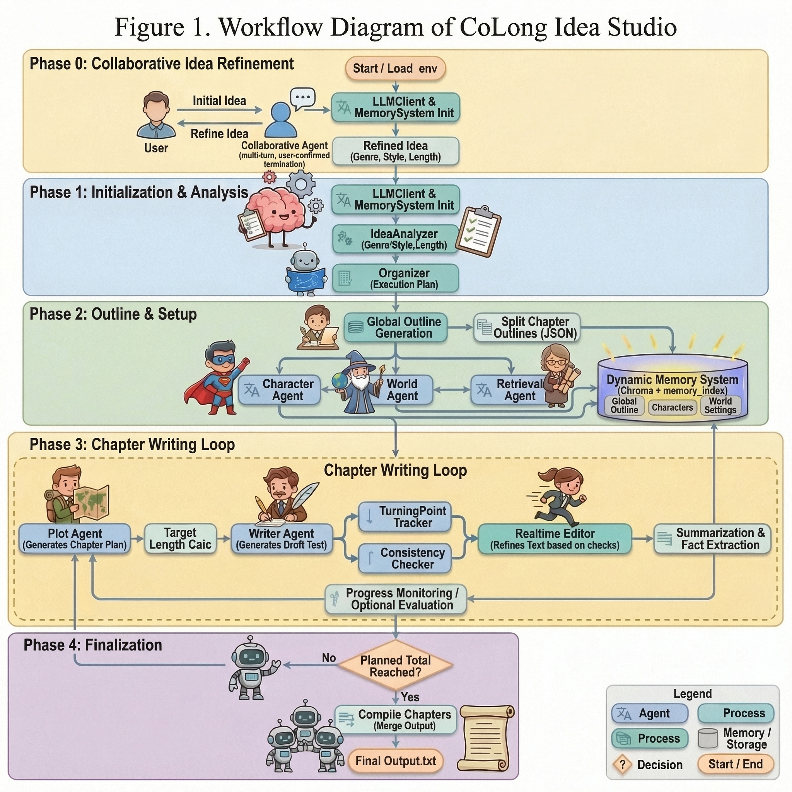

# CoLong Idea Studio

<div align="center">

**动态记忆的协同式长篇小说生成智能体框架**


</div>

## 摘要

`CoLong Idea Studio` 面向“长篇、分章、强一致性”小说生成任务，采用**动态记忆优先**范式。  
系统在生成过程中持续执行“写作-检索-存储-回注”闭环，以保障跨章节一致性。

## 系统架构



> 当前系统架构先使用提供的工作流图片。请将该图片放置到 `docs/workflow-diagram-colong-idea-studio.png`，GitHub 页面即可正常展示。

## 方法设计

### 1) 章节长度区间推断

第 `t` 章长度区间优先级：

1. 优先解析章节大纲中的显式区间。
2. 否则尝试解析全局大纲中的显式区间。
3. 若仍缺失，则回退到 `0.9 * chapter_target` 到 `1.12 * chapter_target`。

### 2) 动态记忆上下文构建

写作提示上下文由以下部分组成：

1. 固定注入：滚动摘要、最近章节摘要、最近事实卡片。
2. 语义检索：从动态记忆向量库召回相关条目。
3. 类型聚合：人物、大纲、世界观、情节与事实分组组织。

---

## Progress Log 协议

路径：

```text
runs/<run_id>/progress.log
```

事件行格式：

```text
[event] YYYY-MM-DD HH:MM:SS | <event_name> | chapter <n> | <detail>
```

结构化章节行：

```text
chapter=<n>, words=<w>, planned_total=<p>, target=<t>, min=<l>, max=<u>, topic=<topic>
```

典型事件：

| 事件名 | 含义 |
|---|---|
| `global_outline` | 全局大纲落库 |
| `chapter_outline_ready` | 章节大纲集合就绪 |
| `chapter_plan` | 当前章节计划 |
| `chapter_outline` | 当前章节大纲摘要 |
| `chapter_length_plan` | 本章 target 与来源 |
| `chapter_length_warning` | 实际字数偏离期望区间 |
| `character_setting` | 人物设定写入 |
| `world_setting` | 世界观设定写入 |
| `memory_snapshot` | memory 快照 |
| `outline_character/world/retrieval` | 大纲阶段写入 |

---

## 动态记忆模型

`memory_index.json` 维护以下桶：

- `texts`
- `outlines`
- `characters`
- `world_settings`
- `plot_points`
- `fact_cards`

说明：

1. `texts` 保存章节正文与阶段文本。
2. `outlines` 保存全局大纲、章节计划、章节摘要、滚动摘要。
3. `fact_cards` 作为轻量事实约束，降低跨章漂移。

## 项目结构

```text
.
├─ agents/                  # 各种写作Agent
├─ workflow/                # analyzer / organizer / executor
├─ rag/                     # 动态记忆与检索
├─ utils/                   # LLM客户端与工具
├─ local_web_portal/        # 多用户 FastAPI 门户
├─ config.py                # 配置中心
└─ main.py                  # CLI 入口
```

---

## 快速启动

### CLI

```bash
python -m venv .venv
# Windows
.venv\Scripts\activate
# Linux/macOS
# source .venv/bin/activate

python -m pip install --upgrade pip
python -m pip install -r requirements.txt
python main.py
```

### Web 门户

```bash
python -m pip install -r requirements.txt
python -m pip install -r local_web_portal/requirements.txt
# Windows
copy local_web_portal\.env.example local_web_portal\.env
# Linux/macOS
# cp local_web_portal/.env.example local_web_portal/.env
python -m uvicorn local_web_portal.app.main:app --host 0.0.0.0 --port 8010
```

访问：`http://127.0.0.1:8010`

---

## 严格白名单部署原则

部署时仅上传运行必需文件，排除：

1. 历史产物：`runs/*`
2. 历史向量库：`vector_db/*`, `vector_db_tmp/*`
3. 本地状态：`local_web_portal/data/*`
4. 缓存与环境：`.venv/*`, `__pycache__/*`, `*.pyc`

该策略可降低体积、简化冷启动并减少泄露风险。

## 引用

```bibtex
@software{colong_idea_studio_2026,
  title        = {CoLong Idea Studio: A Collaborative Agent Framework for Long-Form Novel Generation with Dynamic Memory},
  author       = {xiao-zi-chen and contributors},
  year         = {2026},
  url          = {https://github.com/xiao-zi-chen/CoLong-Idea-Studio}
}
```
